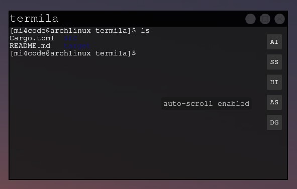

# termila
***terminal app written in Rust based on HUI***

*(still in development, so expect issues)*

`termila [shell or script with arguments]`

### Features
 - [x] Linux support
 - [x] Windows support
 - [ ] MacOS support
 - [ ] Termux Android support
 - [ ] tabs
 - [ ] GUI settings menu
 - [x] Ctrl+C / Ctrl+V copy/paste (windows-alike behaviour)
 - [ ] visible customizable cursor
 - [x] support for non-UTF8 characters
 - [x] support colors and cursor movements
 - [x] correctly working size propagation
 - [ ] buffer size limit setting
 - [ ] color customization
 - [x] AI menu: ask assistant about selected terminal content
 - [ ] AI menu: messaging history (continue conversation or reset it - display separating element); customizable prompt/server
 - [x] saved commands menu: display and enter commands from text file
 - [ ] saved commands menu: render section comments <!-- (with determinated offset to left) --> as folding items <!-- (click to toggle animated hide of following) -->; button to add bookmark/folder <!-- (then move it where you want it) -->; edit/delete buttons <!-- (raw text edit, no form) -->
 - [x] shell history menu: view history
 - [ ] shell history menu: edit history; save command from history <!-- (history <=> saved interoperability) -->
 - [ ] debug menu: view/modify raw data with escape sequences (input/output); cursor position <!-- (stdout/stderr/stdin - not visible for terminal emulator - only visible for shell) -->
 - [ ] good performance <!-- rewrite parser to use double vec (of lines of chunks) - should allow for faster cursor movements --> <!-- blocking PTY read (less cpu usage, but need to implement ui handling loop) + read/write in chunks (much faster) --> <!-- set new style by calling set_cursor (without getting/setting cursor position) --> <!-- avoid specifiing lifetimes for BUFF -->
 - [ ] bug-free parser <!-- parser bugs: nano newlines, gotop graph offset up -->

### Building

clone this repo `git clone https://github.com/mi4code/termila`

clone and [build HUI](https://github.com/mi4code/HUI?tab=readme-ov-file#building-hui) (build should be in `termila/../HUI/build`)

build and run: `cargo run --release`

### Configuration

*(not documented, see [this](https://github.com/mi4code/termila/blob/master/src/main.rs#L58))*

<!--
TERMILA_<OPTION>
*config file = GUI settings*
default value

#### Menus

#### Saved commands

 `TERMILA_SAVED_COMMANDS=commands.txt `

#### History

-->

